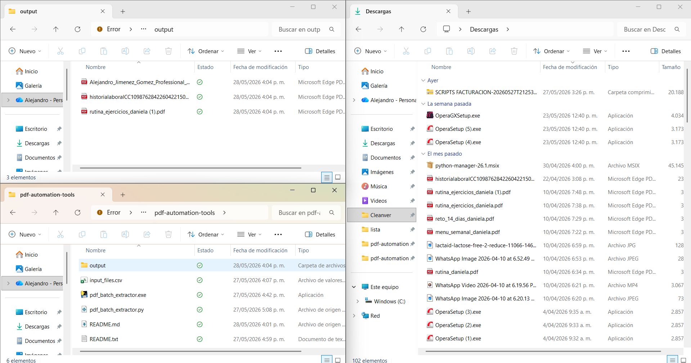

# PDF Batch Extractor

Python script to automatically copy multiple PDF files using a CSV list.

## Description

This project automates the process of searching and copying specific PDF files from a folder. Instead of doing it manually, the process is completed in seconds.

## How it works

1. A CSV file is provided with the file names.
2. The script searches for those files in a source folder.
3. If found, the files are copied to an output folder.

## Project structure

pdf-automation-tools/
- pdf_batch_extractor.py
- pdf_batch_extractor.exe
- input_files.csv
- output/

## Usage

Option 1: Run with Python
python pdf_batch_extractor.py

Option 2: Run the executable
Double click: pdf_batch_extractor.exe

## CSV format

The file input_files.csv must contain a column named:

nombre

Example:

nombre
file1
file2
file3

## Configuration

Inside the script you can modify:
- Source folder (where the PDFs are located)
- Destination folder (output)

## Author

Project created to automate repetitive tasks and improve efficiency in real work environments.

## Screenshot

=======================================================================================================

# PDF Batch Extractor

Script en Python para copiar múltiples archivos PDF de forma automática usando una lista en CSV.

## Descripción

Este proyecto automatiza la búsqueda y copia de archivos PDF específicos dentro de una carpeta. En lugar de hacerlo manualmente, el proceso se realiza en segundos.

## Cómo funciona

1. Se proporciona un archivo CSV con los nombres de los archivos.
2. El script busca esos archivos en una carpeta de origen.
3. Si los encuentra, los copia a una carpeta de salida.

## Estructura del proyecto

pdf-automation-tools/
- pdf_batch_extractor.py
- pdf_batch_extractor.exe
- input_files.csv
- output/

## Uso

Opción 1: Ejecutar con Python
python pdf_batch_extractor.py

Opción 2: Ejecutar el programa
Doble clic en: pdf_batch_extractor.exe

## Formato del CSV

El archivo input_files.csv debe tener una columna llamada:

nombre

Ejemplo:

nombre
archivo1
archivo2
archivo3

## Configuración

Dentro del script puedes modificar:
- Carpeta de origen (donde están los PDFs)
- Carpeta de destino (output)

## Autor

Proyecto creado para automatizar tareas repetitivas y mejorar la eficiencia en entornos de trabajo.
